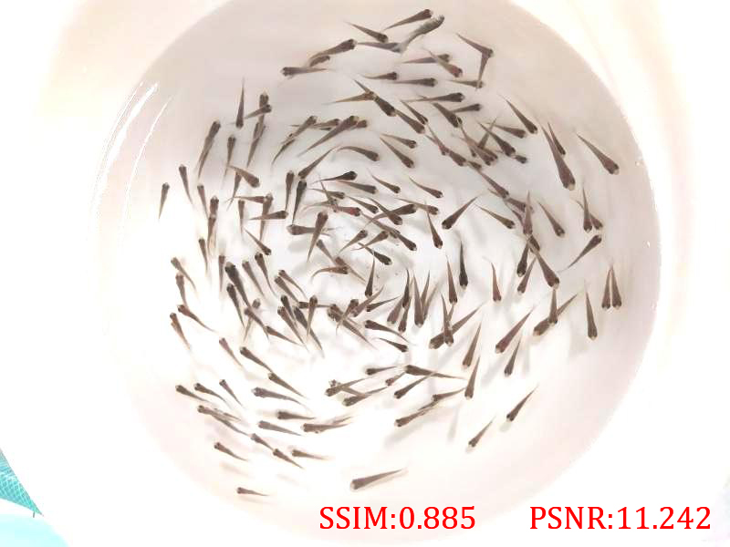

# MSENet: A Lightweight Network for Portable Fry Counting Devices
The official resources of the paper：
>  [**MSENet: A Lightweight Network for Portable Fry Counting Devices**](https://doi.org/10.1016/j.asoc.2023.110140)  
>  Weiran Li, Qian Zhu, Hanyu Zhang, Ziyu Xu, Zhenbo Li  
>  [**\[Paper\]**](https://doi.org/10.1016/j.asoc.2023.110140) [**\[Code\]**](https://github.com/vranlee/MSENet/)


<!-- ```
#TODO Citation
``` -->

Contact: vranlee@cau.edu.cn. Any questions or discussion are welcome!

-----

## Updates
+ [2021.1.18] We updated the sample official resources of the [**MSENet**](https://github.com/vranlee/MSENet).

-----

## Counting performance

+ Density Map


+ Outputs Images


+ Results on the **NCAUF** Dataset

   Dataset | MAE ↓| MSE ↓|
   --------|------|------|
   NCAUF   | 3.33 | 4.58 |

## Abstract
Fry counting is significant for the calculation of the survival rate, fish density, and the development of fishery resources. Compared with the traditional physical shunt devices, visual-based algorithms have benefits of non-restrictions of labor, minimal cost of equipment installation and maintenance. The vision-based models are preferred in applications for a mobilizable apparatus, but they generally come with massive calculations and model parameters, or poor abilities of aggregation handles and counting precision. In this paper, we propose a fry counting network named MSENet for portable fry counting devices. Firstly, we focus on a lightweight network, compress our network with simpler parameters (Params: 139.46 kB), which make our MSENet embedded into portable equipment for deeply restrictive aquaculture scenarios. Then, we utilize the Squeeze-and-Excitation block to strengthen the features of weighty channels. The visualized single-channel fry density maps are predicted by feeding the original images, and the number of fries is calculated through integration, which competently solves the issue of fry aggregation. What’s more, the model training is refined by our hyperparameter studies, the shortened preparation stage enhances the portability of our model. The results demonstrate that our lightweight MSENet outperforms in fry counting with a higher precision (3.33 MAE).

## Contributions
+	Our lightweight (Params: 139.46 kB) model compresses the parameters and calculations virtually, which is feasible to incorporated in a mobile device in aquaculture. We verify in Section 3 that our model outperforms typical counting algorisms.
+	To strategically enhance the precision of the vision-based fry counting approach, the Squeeze-and-Excitation block is embedded into the network; to tackle the small-scale fry aggregations, density map regression is utilized for apportioning of fry aggregation.
+	We design a lightweight network MSENet especially for portable devices of fry counting in feeding pond scenarios. The hyperparameters of our network are optimized to refine the training stage for migrations of aquaculture scenarios.

## Preparation
+ **Step.1** Clone this repo.
+ **Step.2** Install dependencies. We use **python 3.9.7** and **CUDA 11.3**.
   ```
   conda create -n MSENet
   conda activate MSENet
   conda install pytorch torchvision torchaudio cudatoolkit=11.3 -c pytorch
   cd {Repo_ROOT}
   pip install -r requirements.txt
   ```

## Baseline model
Our pretrained **MSENet** model can be downloaded here:   

+  **MSENet_NCAUF_SC.pth: [[Onedrive]](https://1drv.ms/u/s!AiAYwd6-_n-fmmRV_KcCuopz8RzS?e=g12QAe) [[BaiduYun: b910]](https://pan.baidu.com/s/15_PSajF8mk282DmFMNJ7xw)**


## Data Preparation
We provide some samples of our **NCAUF** dataset. The sample datasets can be download from: **[[Onedrive]](https://1drv.ms/u/s!AiAYwd6-_n-fmmPKYTnKDLpui-_Z?e=ruTInN) [[BaiduYun: zlxl]](https://pan.baidu.com/s/1dKWj99BuoNTOP2om5bdFCw)**

 *The **NCAUF_Samples.tar** includes sample images and corresponding annotation files.*

Class  | Sample |  Class  | Sample |  Class  | Sample |
---------|------|---------|--------|---------|--------|
   | Sparse |  | Slightly Dense |  | Dense |
  | Original |  | Bright+ |  | Bright- |
  | Contrast+ |  | Smoothing |  | Gaussian Noise |


## Recommended Resources
+ We recommend a third-party counting framework: [gjy3035/C-3-Framework](https://github.com/gjy3035/C-3-Framework).  
Thanks for their wonderful works!
